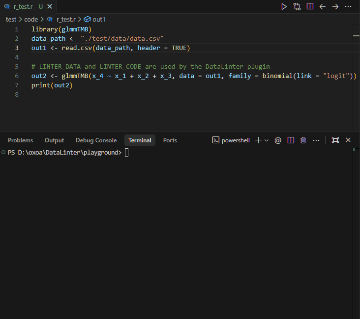

# DataLinter for R (VS Code Extension)

Analyze your R code and datasets interactively using the **DataLinter** service directly within VS Code. This extension extracts active datasets from your running R console, captures the selected context, and sends them to a local or remote DataLinter server to produce an interactive dashboard showing check statuses, severity levels, and detailed lint information.

<p align="center">
  
</p>

---

## 📋 Prerequisites

Before running the DataLinter R CLI Runner, ensure you have the following components set up:

### 1. R Environment
* **R installation**: [R](https://www.r-project.org/) must be installed and configured on your system.
* **VS Code R Extension**: The official [R extension](https://marketplace.visualstudio.com/items?itemName=REditorSupport.r) for running code with `Ctrl+Enter` and managing the terminal session.
* **Active R Session**: You must have an active R Interactive terminal open in VS Code where your data frames and variables are loaded in memory.

### 2. DataLinter Server
The extension sends code and CSV data to an HTTP-based DataLinter server.
* Ensure you have the [DataLinter Server](https://zgornel.github.io/DataLinter/dev/examples/#datalinterserver-HTTP-based-linting) running.

Sample docker run:
```docker run -it --rm -p10000:10000  ghcr.io/zgornel/datalinter-compiled:latest datalinterserver/bin/datalinterserver   -i 0.0.0.0  -p 10000   --config-path  /datalinter/config/r_modelling_config.toml  --log-level debug```

* By default, the extension targets `http://localhost:10000/api/lint`.

---

## 🚀 How to Use

1. **Start the DataLinter Server**: Make sure your local DataLinter HTTP server is running at the configured endpoint (e.g., `http://localhost:10000`).
2. **Load your Data**: In your R script, select and run the code that creates your dataset (e.g., using `Ctrl+Enter` to send it to the R Interactive terminal).
3. **Run the Linter**:
   * Highlight one or multiple lines of code or the dataset variable name (e.g., `out1` or a model call containing `data = out1`).
   * Right-click the selection and choose **"Analyze Selection with DataLinter for R"** from the context menu.
   * Or open the Command Palette (`Ctrl+Shift+P` / `Cmd+Shift+P`) and search for **"R Tools: Analyze Selection with DataLinter for R"**.

---

## 🎨 Features

* **Interactive Webview Dashboard**: See summary cards with totals of passed, failed, and N/A checks. Filter by check status or search for specific columns, rules, or messages dynamically.
* **Smart Terminal Routing**: Automatically detects your `"R Interactive"` or `"R"` terminals to extract data, even if your active focus is on another terminal (like PowerShell or Node tasks).
* **Fault-Tolerant Extraction**: If the variable does not exist in R or throws an error, the extension catches the exception immediately, shows an informative notification toast, and cleans up temporary extraction files.
* **Support for Large Datasets**: Features an adjustable 10-minute timeout for processing and exporting large tables to CSV.

---

## ⚙️ Configuration Settings

This extension contributes the following settings:

* `rServerRunner.serverUrl` (Type: `string`):
  * **Default**: `http://localhost:10000/api/lint`
  * **Description**: The endpoint of the running HTTP-based DataLinter server.

---

## 🛠️ Development & Building

To modify or compile the extension:

1. Clone/open this directory.
2. Install dependencies:
   ```bash
   npm install
   ```
3. Run the compiler in watch mode:
   ```bash
   npm run watch
   ```
4. Press `F5` in VS Code to open a Extension Development Host window to test the changes.
